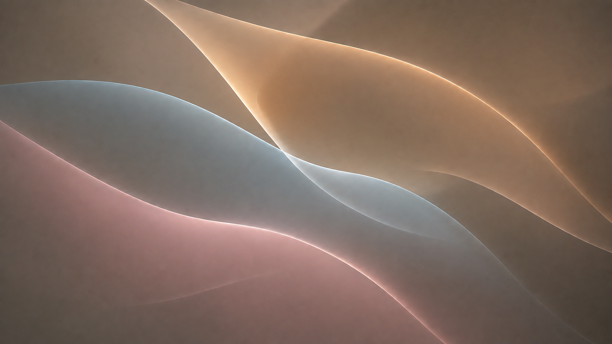

# Claude Glass Heller

A brighter smoky-taupe companion — deliberately midtone, never glaring white. Built from the Claude Dark palette for **Omarchy 4, Quickshell and Lua-based Hyprland**.



## Design

Flowing smoked glass, 18 px corners, soft shadows and copper/champagne highlights. Terminals use 70% background opacity; text stays opaque.

Your existing terminal and code fonts are preserved. Heller means “brighter”; it is not a white/light-mode theme.

## Install

For a new installation:

```sh
omarchy theme install https://github.com/unusepluribus/omarchy-claude-glass-heller-theme.git
```

Already installed? Select it in Omarchy's theme menu or run:

```sh
omarchy theme set claude-glass-heller
```

**Back up an existing theme directory first.** The installed Omarchy theme installer may replace a directory with the same name. Do not use the install command to replace an existing project symlink; update that checkout instead.

## Bar and optional extras

Installing this theme applies colors, wallpaper, terminal transparency and Hyprland styling. It **does not replace your bar, rearrange widgets, install plugins or change your code font**.

A theme alone cannot give the stock bar floating geometry. `extras/floating-bar.patch` documents the tested change to a **user-owned clone** of the Omarchy bar, including an optional floating toggle. It is a version-specific patch for review, not an automatic installer. Never patch `/usr/share/omarchy`; clone `omarchy.bar` first using `omarchy plugin clone omarchy.bar`, inspect the patch and use `patch --dry-run` on the clone before applying it. A failed context check means the installed bar version needs a fresh adaptation.

The adapted clone provides `omarchy-shell claude-glass-bar toggleFloating` and `setFloating true/false`. These methods do not exist on an unmodified stock or Shibumi bar.

`extras/sync-foot-background-opacity` is an optional theme-set hook for updating already-open Foot terminals. Review it before installing it with `omarchy hook install theme-set /absolute/path/to/extras/sync-foot-background-opacity`. Without the hook, open a new Foot window to pick up its startup alpha settings.

## Compatibility and limits

Tested locally on 2026-09-06 with Omarchy-dev 4.0.0.r6673.g5939caf-1, Hyprland 0.56.1-3 and Quickshell 0.3.0.r20.g28771c7-2; one laptop display at 2× scaling. This release targets the newer Lua/Quickshell configuration, not legacy Hyprland `.conf` or Waybar setups. 

TOML and Lua syntax were checked. More monitors and different Omarchy versions need testing. Not every application implements transparent backgrounds.

## Wallpaper, license and related themes

The wallpaper is AI-generated; its actual size and prompt are in [WALLPAPER.md](WALLPAPER.md). It is not a native 4K image. Theme code uses the MIT license; included original wallpaper files may be used and redistributed with the theme.

[Claude Glass](https://github.com/unusepluribus/omarchy-claude-glass-theme) · [Glass Heller](https://github.com/unusepluribus/omarchy-claude-glass-heller-theme) · [Claude Atelier](https://github.com/unusepluribus/omarchy-claude-atelier-theme) · [Atelier Heller](https://github.com/unusepluribus/omarchy-claude-atelier-heller-theme)

Independent community themes; not affiliated with Anthropic or Apple.
